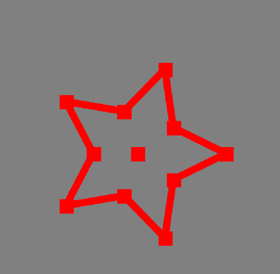
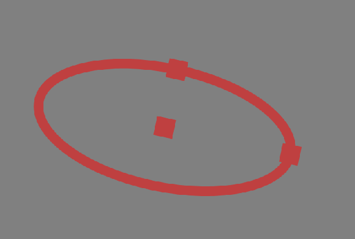

# SharpCanvas

**SharpCanvas** 是一个轻量级且易于使用的 WPF 控件，用于绘制和渲染 2D 图形。
它提供了一个简单直观的 API 来绘制形状、文本和图像，
并支持广泛的绘图选项，如填充、描边和阴影。

还支持交互性，包括用于编辑形状的鼠标和触摸输入；
缩放、平移和选择也支持交互式编辑。

最后，您可以将绘制的图形导出为任意大小的位图，
画布中的形状将被保留并保持比例。

<!--TOC-->
  - [形状](#shapes)
    - [形状结构](#shape-structures)
      - [圆形](#circle)
      - [椭圆](#ellipse)
      - [线条](#line)
      - [多边形](#polygon)
      - [十字](#cross)
      - [一维矩形](#rectangle1d)
      - [二维矩形带角度](#rectangle2d-with-angle)
      - [文本](#text)
      - [图像](#image)
  - [接口概述](#interfaces-oveview)
  - [用法](#usage)
    - [创建画布](#create-a-canvas)
    - [配置](#configurations)
    - [显示形状](#display-shapes)
      - [圆形](#circle)
      - [椭圆](#ellipse)
      - [线条](#line)
      - [多边形](#polygon)
      - [十字](#cross)
      - [一维矩形](#rectangle1d)
      - [二维矩形](#rectangle2d)
      - [文本](#text)
      - [图像](#image)
    - [附加形状（交互性）](#attach-shapesinteractivity)
    - [分离形状](#detach-shapes)
    - [获取附加结构](#get-attach-structure)
    - [清除形状](#clear-shapes)
    - [清除画布](#clear-canvas)
    - [导出为位图](#dump-to-bitmap)
  - [快速开始](#quick-start)
<!--/TOC-->

## 形状
- `圆形`
- `椭圆`带角度
- `线条`由起点和终点定义
- `多边形`由点定义
- `十字`由单点定义
- `一维矩形`
- `二维矩形`带角度
- `文本`
- `图像`

### 形状结构
#### 圆形
```csharp
public record Circle : IShapeStructure
{
    public double Radius;
    public double CenterX;
    public double CenterY;
}

#### 椭圆
```csharp
public record Ellipse : IShapeStructure
{
    public double RadiusX;
    public double RadiusY;
    public double CenterX;
    public double CenterY;
    public double RotationDegree;
}
```


#### 线条
```csharp
public record Line : IShapeStructure
{
    public double X1;
    public double Y1;
    public double X2;
    public double Y2;
}
```

#### 多边形
```csharp
public record Polygon : IShapeStructure
{
    public List<Point> Points;
    public bool IsClosed;
}
```

#### 十字
```csharp
public record Cross : IShapeStructure
{
    public double Size;
    public Point Center;
    public double AngleDegree;
}
```

#### 一维矩形
```csharp
public record Rectangle1D : IShapeStructure
{
    public double Width;
    public double Height;
    public double X;
    public double Y;
}
```

#### 二维矩形带角度
```csharp
public record Rectangle2D : IShapeStructure
{
    public double HalfWidth;
    public double HalfHeight;
    public double CenterX;
    public double CenterY;
    public double AngleDegree;
}
```

#### 文本
```csharp
public record Text : IShapeStructure
{
    public string _Text;
    public double X;
    public double Y;
    public SolidColorBrush Brush = null;
    public double FontSize = 16;
}
```

#### 图像
`BitmapFrame` 用于表示图像。

## 接口概述
```csharp
public interface ICVCanvas
{
    //--------------------------------显示----------------------------
    void CV_DisplayImage(
        BitmapFrame image,
        double x = 0,
        double y = 0,
        double width = 0,
        double height = 0,
        double canvasW = 0,
        double canvasH = 0
    );
    void CV_DisplayRectangle1D(Rectangle1D rectangle1D, double canvasW = 0, double canvasH = 0);
    void CV_DisplayRectangle1Ds(
        List<Rectangle1D> rectangle1D,
        double canvasW = 0,
        double canvasH = 0
    );
    void CV_DisplayRectangle2D(Rectangle2D rectangle2D, double canvasW = 0, double canvasH = 0);
    void CV_DisplayRectangle2Ds(
        List<Rectangle2D> rectangle2D,
        double canvasW = 0,
        double canvasH = 0
    );
    void CV_DisplayCircle(Circle circle, double canvasW = 0, double canvasH = 0);
    void CV_DisplayCircles(List<Circle> circles, double canvasW = 0, double canvasH = 0);
    void CV_DisplayEllipse(Structure.Ellipse ellipse, double canvasW = 0, double canvasH = 0);
    void CV_DisplayEllipses(
        List<Structure.Ellipse> ellipses,
        double canvasW = 0,
        double canvasH = 0
    );
    void CV_DisplayCross(Cross cross, double canvasW = 0, double canvasH = 0);
    void CV_DisplayCrosses(List<Cross> crosses, double canvasW = 0, double canvasH = 0);
    void CV_DisplayLine(Structure.Line line, double canvasW = 0, double canvasH = 0);
    void CV_DisplayLines(List<Structure.Line> lines, double canvasW = 0, double canvasH = 0);
    void CV_DisplayText(Text text, double canvasW = 0, double canvasH = 0);
    void CV_DisplayPolygon(
        Structure.Polygon polygon,
        bool isClosed = true,
        double canvasW = 0,
        double canvasH = 0
    );
    void CV_DisplayPolygons(
        List<Structure.Polygon> polygons,
        bool isClosed = true,
        double canvasW = 0,
        double canvasH = 0
    );

    //------------------------------附加------------------------------
    void CV_AttachRectangle1DToCanvas(string name, Rectangle1D rectangle1D);
    void CV_AttachRectangle2DToCanvas(string name, Rectangle2D rectangle2D);
    void CV_AttachCrossToCanvas(string name, Cross cross);
    void CV_AttachCircleToCanvas(string name, Circle circle);
    void CV_AttachEllipseToCanvas(string name, Structure.Ellipse ellipse);
    void CV_AttachLineToCanvas(string name, Structure.Line line);
    void CV_AttachPolygonToCanvas(string name, Structure.Polygon polygon);

    //----------操作----------
    void CV_FitImageToCanvas(double canvasW = 0, double canvasH = 0);
    T CV_GetAttachStruture<T>(string name)
        where T : IShapeStructure;
    void CV_Detach(string name);
    void CV_SetStrokeColor(Brush brush, double thickness, int opacity = 100);
    void CV_SetFillColor(Brush brush, int opacity = 100);
    Task<BitmapFrame> CV_Dump(int width = 0, int height = 0);
    void CV_ClearShapes();
    void CV_Clear();
    void CV_SetThumbSize(int size);
}
```

## 用法
### 创建画布
```xml
<sharpCanvas:MyCanvas x:Name="myCanvas"  ClipToBounds="True"
xmlns:sharpCanvas="clr-namespace:SharpCanvas;assembly=SharpCanvas"/>
```

### 配置
```csharp
//调整显示形状的填充
myCanvas.CV_SetFillColor(Brushes.Yellow, 30);
//调整显示形状的描边
myCanvas.CV_SetStrokeColor(Brushes.Red, 1);
//调整编辑形状的缩略图大小
myCanvas.CV_SetThumbSize(10);
```


### 显示形状
#### 圆形
```csharp
myCanvas.CV_DisplayCircle(new(100, 200, 200));
```

#### 椭圆
```csharp
myCanvas.CV_DisplayEllipse(new(100, 50, 200, 200));
```

#### 线条
```csharp
myCanvas.CV_DisplayLine(new(100, 100, 200, 200));
```

#### 多边形
```csharp
// 绘制心形
var points = new List<Point>();
int numPoints = 50;
double scale = 10; // 调整心形的大小

for (int i = 0; i < numPoints; i++)
{
    double t = 2 * Math.PI * i / numPoints;
    double x = scale * (16 * Math.Pow(Math.Sin(t), 3));
    double y =
        -scale
        * (13 * Math.Cos(t) - 5 * Math.Cos(2 * t) - 2 * Math.Cos(3 * t) - Math.Cos(4 * t));
    points.Add(new Point(x, y));
}
myCanvas.CV_SetFillColor(Brushes.Pink, 70);
myCanvas.CV_DisplayPolygon(
    new SharpCanvas.Shapes.Structure.Polygon(points.Translate(300, 300), false)
);
```

#### 十字
```csharp
var height = this.myCanvas.m_currentImage.PixelHeight;
var width = this.myCanvas.m_currentImage.PixelWidth;
var random = new Random();
var crosses = new List<Point>();
this.myCanvas.CV_SetStrokeColor(Brushes.Red, 1);
for (int i = 0; i < 5000; i++)
{
    var x = random.Next(0, (int)width);
    var y = random.Next(0, (int)height);
    crosses.Add(new Point(x, y));
}
List<Cross> crosses1 = crosses.Select(p => new Cross(p, 45, 5)).ToList();
var sw = Stopwatch.StartNew();
this.myCanvas.CV_DisplayCrosses(crosses1);
sw.Stop();
```

#### 一维矩形
```csharp
var rect = new Rectangle1D(100, 100, 200, 200);
myCanvas.CV_DisplayRectangle1D(rect);
```

#### 二维矩形
```csharp
var rd = new Random();
var rects = new List<Rectangle2D>();
for (int i = 0; i < 10000; i++)
{
    var rect = new Rectangle2D(
        100,
        100,
        rd.Next(100, myCanvas.m_currentImage.PixelWidth - 100),
        rd.Next(100, myCanvas.m_currentImage.PixelHeight - 100),
        45
    );
    rects.Add(rect);
}

var sw = Stopwatch.StartNew();

for (int i = 0; i < 10000; i++)
{
    myCanvas.CV_DisplayRectangle2D(rects[i]);
}

sw.Stop();
```


#### 文本
```csharp
myCanvas.CV_DisplayText(
    new Text(
        "Visiter the on more on the mefilled dream this agreeing the vainly velvet raven front smiling the soul prophet the",
        12,
        12,
        Brushes.Blue,
        16
    )
);
```

#### 图像
```csharp
var path = @"D:\Image.bmp";
BitmapFrame image = BitmapFrame.Create(new Uri(path));
myCanvas.CV_DisplayImage(image);
```

### 附加形状（交互性）
```csharp
//附加一个矩形到画布
myCanvas.CV_AttachRectangle1DToCanvas("rect1", new Rectangle1D(100, 100, 200, 200));
//附加一个圆形到画布
myCanvas.CV_AttachCircleToCanvas("circle1", new Circle(100, 100, 50));
```
附加一个带多边形的心形到画布



附加一个45°的椭圆到画布



### 去除形状
```csharp
myCanvas.CV_Detach("rect1");
myCanvas.CV_Detach("circle1");
```

### 获取附加结构
```csharp
var rect1 = myCanvas.CV_GetAttachStruture<Rectangle1D>("rect1");
var circle1 = myCanvas.CV_GetAttachStruture<Circle>("circle1");
```

### 清除形状
**注意**： 这不会清除画布上显示的图像。
```csharp
myCanvas.CV_ClearShapes();
```

### 清除画布
**注意**： 这将清除画布上显示的所有形状和图像。
```csharp
myCanvas.CV_Clear();
```

### 导出为位图
```csharp
var path = SaveFileDialog(false, "jpg");
if (string.IsNullOrEmpty(path))
{
    return;
}
var bmp = myCanvas.CV_Dump(3000, 3000).GetAwaiter().GetResult();
JpegBitmapEncoder encoder = new JpegBitmapEncoder();
encoder.Frames.Add(bmp);
using var fs = new FileStream(path, FileMode.Create);
encoder.Save(fs);
```

## 快速开始
1. 在 Visual Studio 中创建一个新的 WPF 项目。
2. 添加对 SharpCanvas 库的引用。
3. 在您的 XAML 文件中添加一个 Canvas 控件。
4. 在您的 XAML 文件中添加以下代码：
```xml
<sharpCanvas:MyCanvas x:Name="myCanvas"  ClipToBounds="True"
xmlns:sharpCanvas="clr-namespace:SharpCanvas;assembly=SharpCanvas"/>
```
5. 在您的Designer.cs文件中添加以下代码：
```csharp
//绘制一个圆形
myCanvas.CV_DisplayCircle(new(100, 200, 200));
```
6. 运行您的项目，并查看圆形是否显示在画布上。